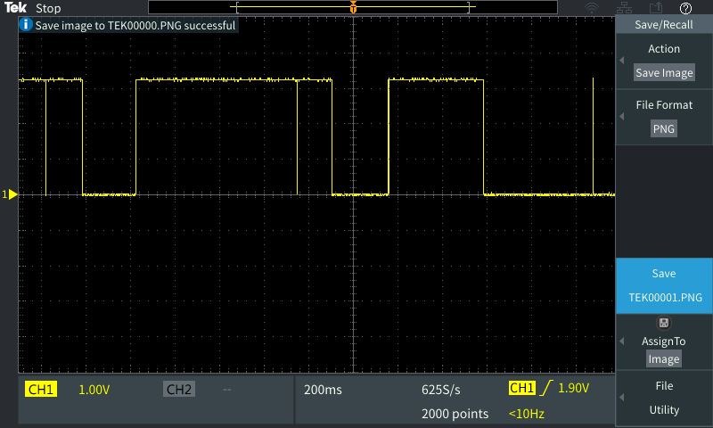
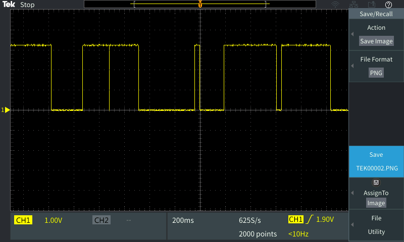

In general, this method performed very poorly. This was tested in the RBE lab, with about 20 people active in the lab. Since performance characteristics were so bad during the lower end of expected conditions, more in-depth metrics of wireless traffic were not measured.  In the test conditions, the ESP32 was setup as the access point, and the Android phone acted as the TCP server. An LG G5 was used for this test running Android 7.0.

Results with Java ScheduledExecutorService and TimerTask with 50msec periods:

Results with ESP as the TCP server:

