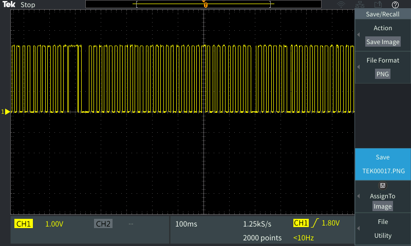

In general, this method with performed very poorly. This was tested in the RBE lab, with about 20 people active in the lab. Since performance characteristics were so bad during the lower end of expected conditions, more in-depth metrics of wireless traffic were not measured.  In the test conditions, the ESP32 was setup as the access point, and the Android phone acted as the TCP server. An LG G5 was used for this test running Android 7.0.

Results with Java ScheduledExecutorService and TimerTask with 50msec periods:

Results with ESP as the TCP server:

After switching to sending UDP packets, performance characteristics significantly improved.  Packets were able to be mostly reliably sent at periods of 20, and 10 msec, and jitter characteristics significantly degraded going beyond 10 msec. Note though that there were significantly fewer students in the lab at the time the tests were run. With a period of 20 msec, the IO was able to be switched with relatively low jitter, and was relatively reliable.  However, there are a few instances of jitter up to about 12 msec as shown in the traces below:

With a period of 10 msec, the IO was again relatively reliable, but there were more instances of jitter up to about 10 msec.  

With a period of 5 msec, jitter performance was significantly degraded with jitter up to about 4 msec being relatively common.

When the packet size was increased from the previous 4 bytes to 64 bytes, the jitter characteristics degraded for time periods of 5 and 10 msec where jitter was more common and more extreme.  Jitter for 20 msec spaced packets was relatively consistent with similar jitter as before.

With 10 msec spaced packets, jitter could be as much as about 20 msec, or a packet got dropped.

With 5 msec space packets, jitter could be as much as 10 msec, or a packet got dropped.

